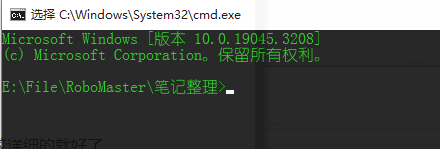
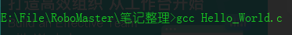
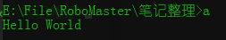
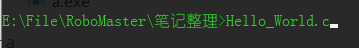

# 如何使用vscode搭配mingw的方式编译c

首先去 微软商店获取  VSCode 

然后去Mingw官网安装MingW环境

网上有很多教程, 跟着其中一个时间较近且较详细的就好了

配置好之后,  进入你存放 .c 源文件的文件夹, 点击上方的存放路径


输入 cmd 并按下回车键后, 会出现命令行窗口, 这时你进入了文件所在的路径里面, 如图: 



输入 gcc + 你要编译的文件, 例如



编译后, 除非你有特殊处理, 否则一般是出现 a.exe


在命令行输入 a.exe 或者 a



就会出现编译后执行好的文件

补充:

+  可以通过输入文件名的前一两个字符 并按下 Tab键 来进行补全 





Mingw测试样例:

```c
//复制一下字符至新建的.c文件后进行按照以上方法编译
//如环境安装没有问题, 则会出现上方的 Hello World
#include <stdio.h>

int main()
{
    printf("Hello World\n");
}
```

