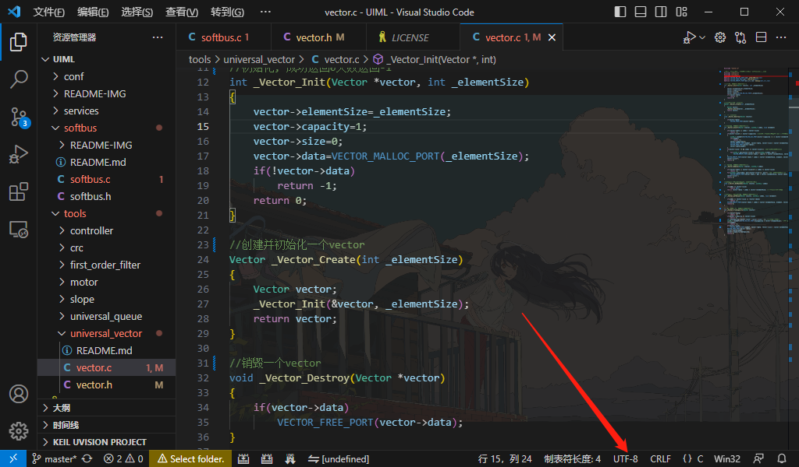

# 如何更改文件编码

如果你不知道什么是文件编码, 请去查好吗, 这很重要😅

以 vscode 举例

箭头所指的地方为你当前文件使用的编码

用鼠标左键单击它 , 会出现通过编码重新打开或者通过编码保存(如下图所示)

如果你的文件打开是乱码, 可以选择通过编码重新打开, 一般会有VSCODE推荐的编码, 选择正确的编码后打开就能正常的浏览文字了

文字正常之后再通过编码保存, 选择你想要的编码保存文件

但是如果你的文件的编码不是 **UTF-8**, 可以请你用**UTF-8**保存吗😥

