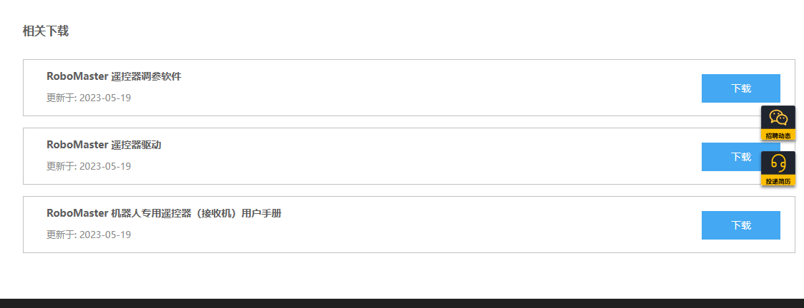

# 如何获取某些产品的文档资料

市面上有头有脸的品牌的产品都能在他们的官方网站或者论坛获取详细的数据手册, 参考手册, 用户手册等资料

如果你想要学习某个产品的使用, 可以先上他们的官网找到相关资料, 再上各种各样的论坛(CSDN, STACKOVERFLOW, 博客园等) 学习别人的经验. 这样学习方法以我个人经验来讲是相对顺利的

这里以 RoboMaster 的 DR16 资料获取和 意法半导体的 F4xx芯片的参考手册为例

+ DR16 相关资料获取

首先电机下方链接, 进入RM官网

[RoboMaster 超级对抗赛 | 大赛介绍](https://www.robomaster.com/zh-CN/robo/overview?djifrom=nav)

点击 RoboMaster 产品 -> 配件 -> 比赛专用产品 -> 输入系统 -> RoboMaster 遥控器套装, 滑到底部,  下载相关资料

如果看官方资料还是看不懂, 可以进入 RM论坛 在里面搜索相关问题

[RoboMaster论坛](https://bbs.robomaster.com/portal.php)

↑ 里面还有很多优秀的开源资料

+ F4xx芯片参考手册

点击下方链接进入 意法半导体官网

[意法半导体-STMicroelectronics](https://www.st.com/content/st_com/zh.html)

点击放大镜进行搜索,  搜索 STM32F4

选择这里想要的芯片资料, 我点的是 STM32F407VE

点击文件

往下滑, 找到参考手册, 并下载

